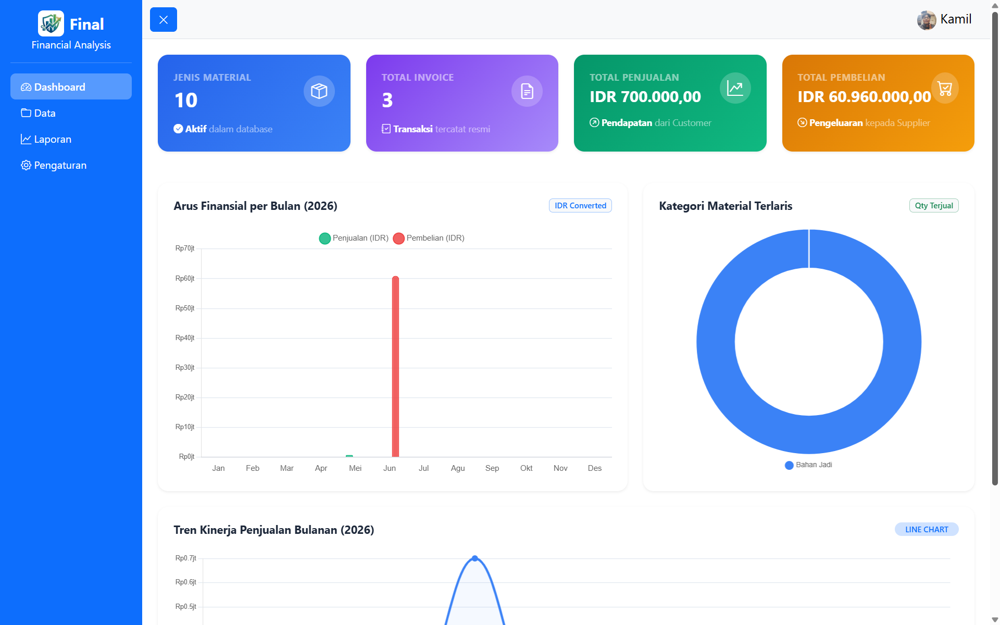
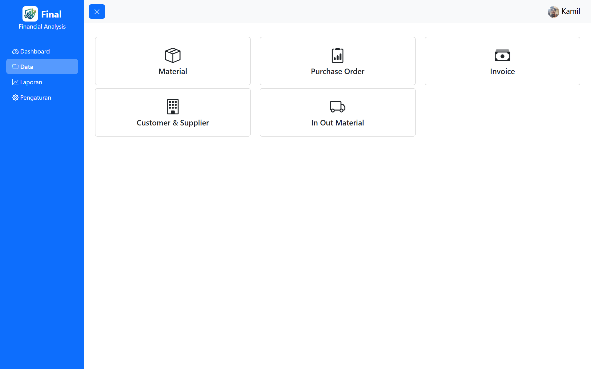
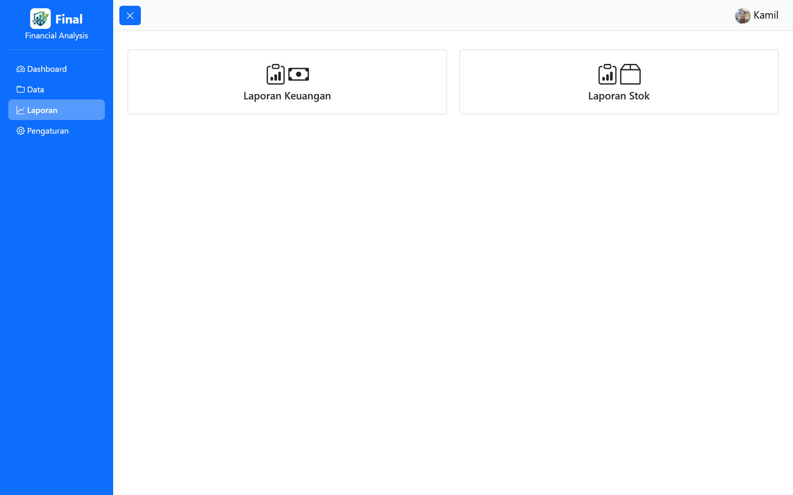
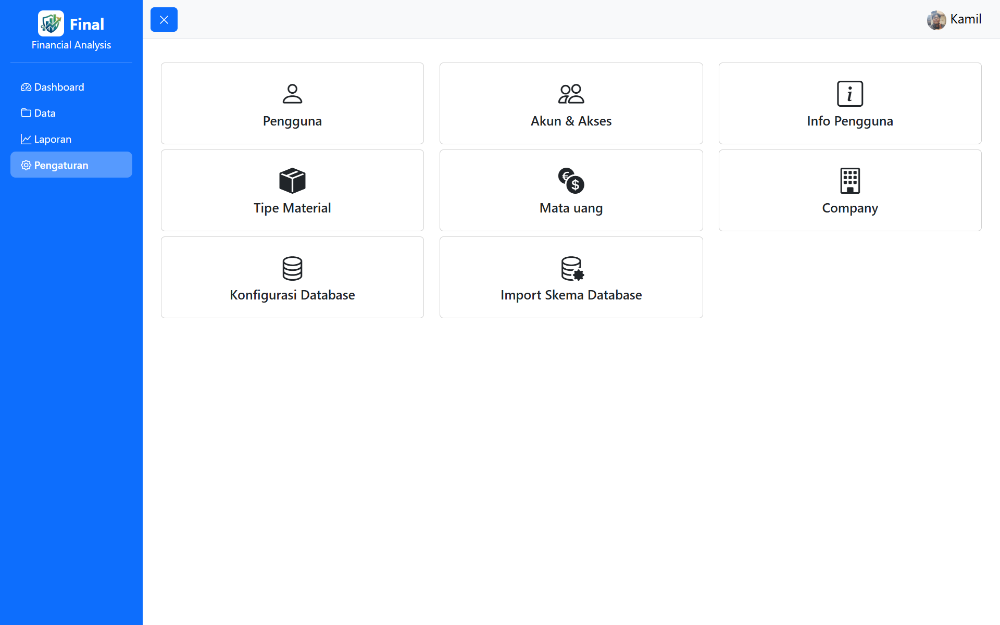

<!-- @format -->

# Final App

Sistem ERP yang sederhana, lengkap, dan mudah digunakan untuk mengelola data operasional perusahaan.


## Tampilan Aplikasi

### Dashboard



### Data Master



### Laporan



### Pengaturan



---

## Persyaratan Sistem

Pastikan lingkungan server memenuhi spesifikasi berikut:

| Komponen | Versi   |
| -------- | ------- |
| Apache   | 2.4.66  |
| PHP      | 8.3.30  |
| MySQL    | 8.4.3   |
| Composer | Terbaru |

### Rekomendasi

Untuk mempermudah proses instalasi dan pengembangan, disarankan menggunakan:

- Laragon
- XAMPP

---

## Instalasi

### 1. Clone Repository

```bash
git clone https://github.com/kamiludin890/Final.git
```

### 2. Masuk ke Direktori Project

```bash
cd Final
```

### 3. Install Dependency

```bash
composer require twbs/bootstrap:^5.3
composer require twbs/bootstrap-icons
```

---

## Login Awal

Gunakan akun bawaan berikut untuk login pertama kali:

```text
Username : admin
Password : admin
```

---

## Konfigurasi Database

1. Login menggunakan akun admin.
2. Buka menu **Pengaturan**.
3. Isi konfigurasi database sesuai server yang digunakan.
4. Simpan konfigurasi.

### Catatan

Saat koneksi database berhasil:

- Sistem akan membuat seluruh tabel yang diperlukan secara otomatis.
- Akun administrator akan otomatis dibuat pada database.
- Aplikasi siap digunakan tanpa proses migrasi tambahan.

---

## Cara Penggunaan

Setelah konfigurasi database selesai:

1. Logout dari aplikasi.
2. Login kembali menggunakan akun administrator.
3. Mulai mengelola data melalui menu yang tersedia.

---

## Fitur Utama

- Dashboard informatif
- Manajemen data master
- Sistem laporan
- Pengaturan aplikasi
- Pembuatan database otomatis
- Pembuatan akun administrator otomatis
- Antarmuka berbasis Bootstrap 5

---

## Teknologi yang Digunakan

- PHP 8.3
- MySQL 8.4
- Bootstrap 5
- Bootstrap Icons
- Apache Web Server

---

## License

[](https://choosealicense.com/licenses/mit/) [](https://opensource.org/licenses/)
[](http://www.gnu.org/licenses/agpl-3.0)
